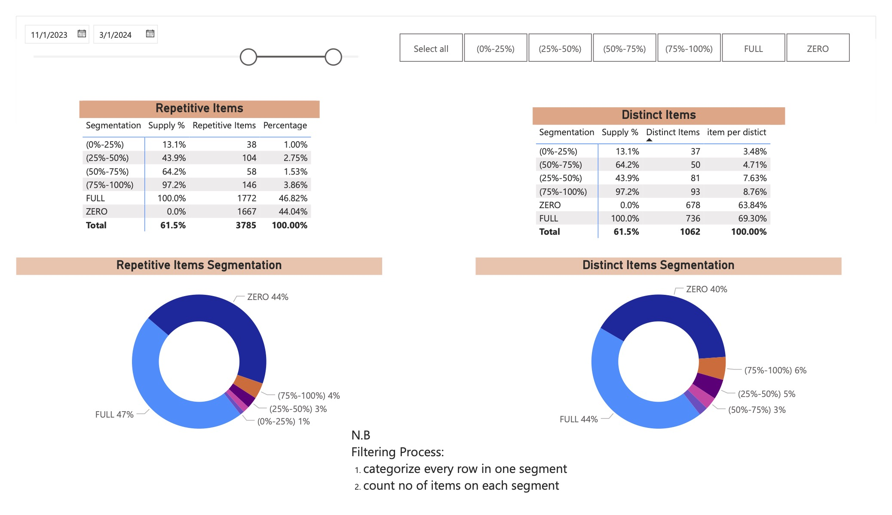
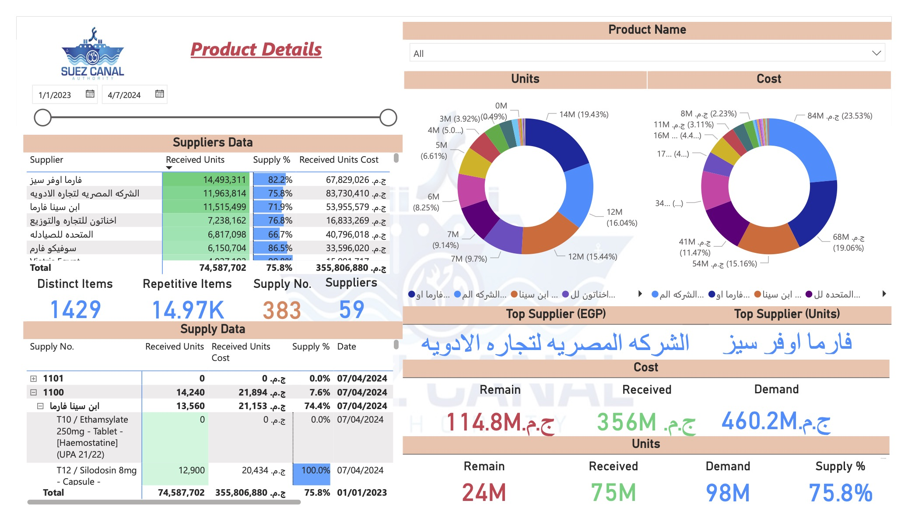

# SCA Pharma-Stream: Data-Driven Procurement Optimization
### Strategic Consultant Case Study: Supply Chain Resilience

## 📌 Project Overview
#### In partnership with the Suez Canal Authority (SCA), this project investigates a critical breakdown in pharmaceutical procurement. While the high-level metrics suggested a stable 72.8% supply rate, a deep-dive diagnostic analysis uncovered a systemic "All-or-Nothing" fulfillment paradox.

#### Nearly half of all medicine requests resulted in 0% delivery, creating a EGP 68.6 Million supply gap. This project provides the diagnostic tools (PowerBI) and the strategic roadmap (CEO Story Deck) to mitigate clinical risk and financial exposure.
---
## 📂 Project Assets & Links
- [🔗 Interactive PowerBI Dashboard](2-outputs/Suez_Canal.pdf)

- [📊 Executive Story Deck PDF](3-Story_deck/Data-Driven%20Procurement%20Optimization.pdf.pdf")

- [📑 Technical Documentation](1-data/Suez%20Canal.xlsx")
---
## 📊 The "Fulfillment Paradox" (Core Insights)
#### Standard reporting at SCA was masking a dangerous reality. By segmenting 12 months of procurement data (June 2023 – March 2024), I identified:

- The Zero-Fulfillment Crisis: 40% of all distinct items ordered have a 0% fulfillment rate. This means nearly half the catalog is never delivered despite recurring demand.

- Financial Exposure: These "Zero-Supply" items account for EGP 35.3 Million in unfulfilled orders.

- Clinical Impact: Critical life-saving drugs (e.g., Vancomycin and Heparin Sodium) were identified in the 0% fulfillment category, directly impacting surgical readiness.

 

 Figure 1: Visualization of the EGP 35.3M gap caused by zero-fulfillment items.

---
## 📈 Interactive PowerBI Dashboards
### I developed a suite of interactive tools to transition SCA from reactive purchasing to proactive supply chain management.

1. Procurement Health Monitor

   This dashboard allows leadership to move beyond averages. It uses dynamic segmentation to isolate "at-risk" items by fulfillment tiers (0-25%, 25-50%, etc.).

- Key Feature: Cross-filtering between item criticality and delivery success.

2. Strategic Supplier Risk

   Analysis revealed that 70% of fulfilled value is concentrated within just 5 suppliers (out of 59).

- Consultant Insight: This high degree of dependency creates a single point of failure. The dashboard allows for benchmarking supplier reliability against the value they provide.

 Figure 2: Supplier concentration analysis identifying high-dependency risks.

---
## 🎤 Executive Strategy (The CEO Story Deck)
#### Data is only valuable if it drives change. I translated the technical findings into a Strategic Story Deck for the SCA Board of Directors, proposing a Three-Pillar Strategy:

- Strategic Supplier Management: Moving from transactional buying to performance-based partnerships.

- Proactive Inventory Planning: Re-classifying inventory based on clinical criticality (Vital vs. Non-Essential).

- Process Systems: Implementing an "Early Warning System" to alert procurement when a high-demand item hits the 0% fulfillment threshold.

[Data-Driven Procurement Optimization](3-Story_deck/Data-Driven%20Procurement%20Optimization.pdf) 🔗 Click here to view the full Story Deck for Leadership

---

## 🛠 Methodology & Tools
- BI Tools: PowerBI (DAX, Data Modeling)

- Data Processing: Power Query / Excel

- Strategy Frameworks: Supplier Segmentation, Risk Heat-Mapping, KPI Architecture

- Presentation: Executive Storyboarding for C-Suite Stakeholders
---
## Project Structure
#### The repository is organized to clearly separate technical work from business storytelling:
##### ├── 1-data/                 # Raw and processed datasets
##### ├── 2-outputs/              # Tables, charts, and derived metrics
##### ├── 3-story_deck/           # Executive presentation (business findings & recommendations)
##### └── README.md             # Project overview and business context
---
## Intended Audience
#### This project is relevant for:
- Business owners and founders
- CEOs and general managers
- Procurement and supply chain leaders
- Finance and strategy teams
- Consulting and advisory reviewers
---
## About the Author
#### This project was developed by a business analyst and consultant with hands-on experience in pharmaceutical distribution, supply chain operations, and SMEs performance optimization, combining business strategy with data analytics and automation.